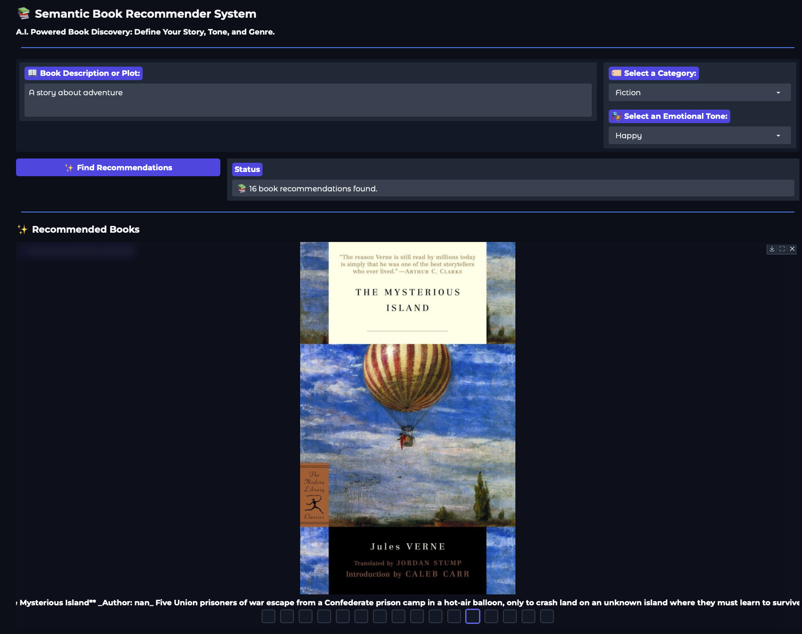

# 📖 Semantic Book Recommender System (AI-Powered)

This project is an **AI-powered semantic book recommendation system** that finds books based on meaning, tone, and genre context rather than keyword matching...
Built with **Sentence Transformers**, **vector search**, and an **interactive Gradio interface**, it offers a modern and intuitive recommendation experience.

***

## 📸 Project Interface

***

## ✨ Key Features

- 🔍 **Semantic Search (RAG-like Retrieval)**
  Uses a pre-trained HuggingFace model (`all-MiniLM-L6-v2`) to embed book descriptions and user queries and retrieve the most semantically similar titles.

- 🎭 **Emotion-Aware Filtering**
  Each book has emotion scores (Joy, Sadness, Fear, Anger, Surprise).
  Filter results based on mood for better personalization.

- 🏷️ **Genre Filtering**
  Narrow down results to categories of interest.

- 🖥️ **Interactive Web UI**
  Simple, fast, and visually pleasant interface powered by **Gradio**.

- 📚 **Clean and Enhanced Dataset**
  Includes preprocessed book metadata, emotional scores, and tokenized descriptions.

---

## 🧠 Tech Stack

| Component | Technology |
|----------|------------|
| Embeddings | HuggingFace Sentence Transformers |
| Vector Search | FAISS / Similarity Search |
| UI | Gradio |
| Data Processing | Python, Pandas, Scikit-learn |
| Emotion Analysis | Text Classification Models |

---
